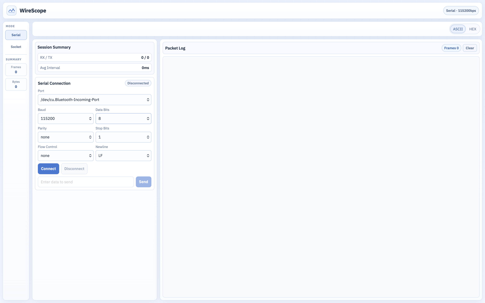
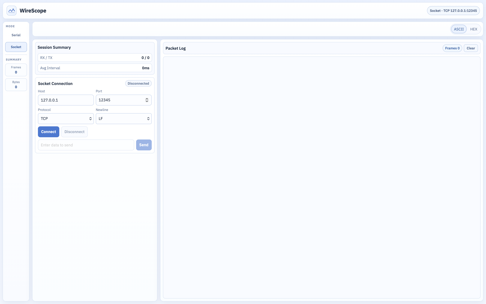

# WireScope

Real-time serial port and network socket monitoring tool

## Installation
1. Download the latest release from the [releases page](https://github.com/lunDreame/wirescope/releases)
2. Extract the downloaded archive to a desired location
3. Run the executable file to start WireScope

## Preview

## LISENCE
Copyright (c) 2026 lunDreame. All rights reserved.
